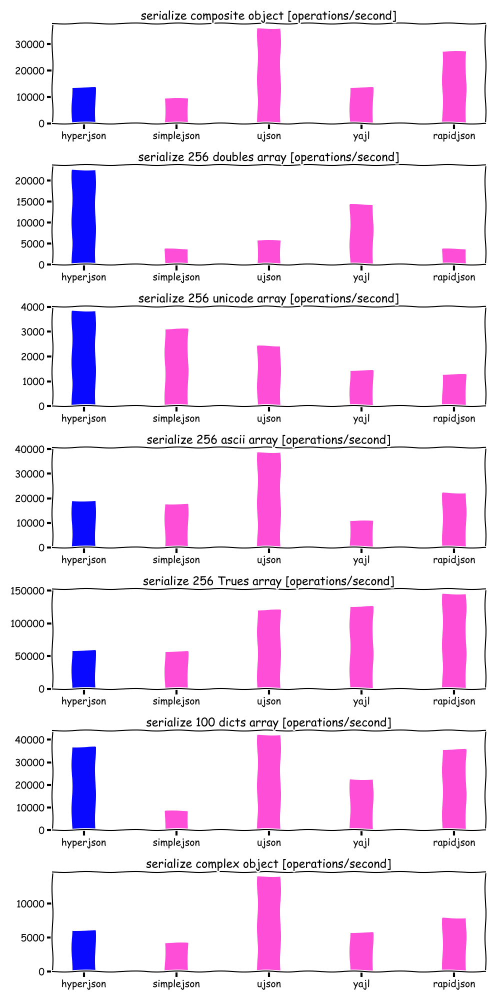
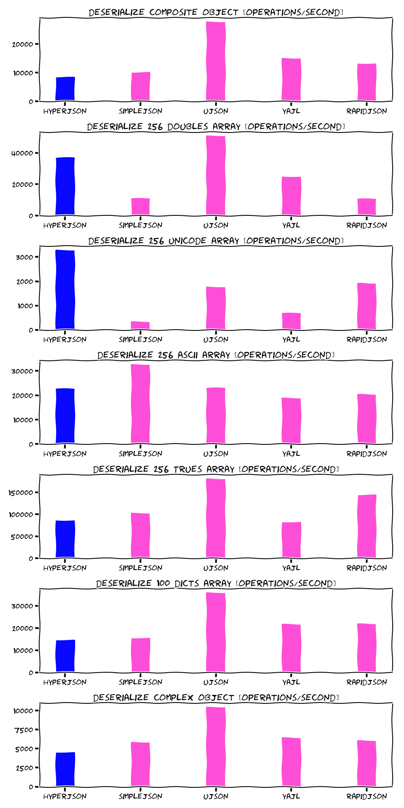

[](https://travis-ci.org/mre/hyperjson)

A hyper-fast, safe Python module to read and write JSON data. Works as a
drop-in replacement for Python's built-in
[json](https://docs.python.org/3/library/json.html) module.
This is alpha software and there will be bugs, so maybe don't deploy to production *just* yet. :wink:

## Installation

```
pip install hyperjson
```

## Usage

hyperjson is meant as a drop-in replacement for Python's [json
module](https://docs.python.org/3/library/json.html):  


```python
>>> import hyperjson 
>>> hyperjson.dumps([{"key": "value"}, 81, True])
'[{"key":"value"},81,true]'
>>> hyperjson.loads("""[{"key": "value"}, 81, true]""")
[{u'key': u'value'}, 81, True]
```

## Motivation

Parsing JSON is a solved problem; so, no need to reinvent the wheel, right?  
Well, unless you care about **performance and safety**.

Turns out, parsing JSON *correctly* is a [hard problem](http://seriot.ch/parsing_json.php). Thanks to Rust however, we can minimize the risk of running into [stack overflows or segmentation faults](https://github.com/esnme/ultrajson/issues) however.

hyperjson is a thin wrapper around Rust's [serde-json](https://github.com/serde-rs/json) and [pyo3](https://github.com/PyO3/pyo3). It is compatible with Python 3 (and 2 on a best-effort basis). 

For a more in-depth discussion, [watch the talk about this project recorded at the Rust Cologne Meetup in August 2018.](https://media.ccc.de/v/rustcologne.2018.08.hyperjson)

## Goals

* **Compatibility**: Support the full feature-set of Python's `json` module.
* **Safety**: No segfaults, panics, or overflows.
* **Performance**: Significantly faster than `json` and as fast as `ujson` (both written in C).

## Non-goals

* **Support ujson and simplejson extensions**:  
  Custom extensions like `encode()`, `__json__()`, or `toDict()` are not
  supported. The reason is, that they go against PEP8 (e.g. `dunder` methods
  are restricted to the standard library, camelCase is not Pythonic) and are not
  available in Python's `json` module.
* **Whitespace preservation**: Whitespace in JSON strings is not preserved.
  Mainly because JSON is a whitespace-agnostic format and `serde-json` strips
  them out by default. In practice this should not be a problem, since your
  application must not depend on whitespace padding, but it's something to be
  aware of.

## Benchmark

We are *not* fast yet. That said, we haven't done any big optimizations.
In the long-term we might explore features of newer CPUs like multi-core and SIMD.
That's one area other (C-based) JSON extensions haven't touched yet, because it might
make code harder to debug and prone to race-conditions. In Rust, this is feasible due to crates like
[faster](https://github.com/AdamNiederer/faster) or
[rayon](https://github.com/nikomatsakis/rayon).

So there's a chance that the following measurements might improve soon.  
If you want to help, check the instructions in the *Development Environment* section below.

**Test machine:**  
MacBook Pro 15 inch, Mid 2015 (2,2 GHz Intel Core i7, 16 GB RAM) Darwin 17.6.18




## Contributions welcome!

If you would like to hack on hyperjson, here's what needs to be done:

- [X] Implement [`loads()`](https://docs.python.org/3/library/json.html#json.loads)
- [X] Implement [`load()`](https://docs.python.org/3/library/json.html#json.load)
- [X] Implement [`dumps()`](https://docs.python.org/3/library/json.html#json.dumps)
- [X] Implement [`dump()`](https://docs.python.org/3/library/json.html#json.dump)
- [X] Benchmark against [json](https://docs.python.org/3/library/json.html) and
  [ujson](https://github.com/esnme/ultrajson/) (see [#1](https://github.com/mre/hyperjson/issues/1))
- [X] Add a CI/CD pipeline for easier testing (see [#2](https://github.com/mre/hyperjson/issues/2))
- [X] Create a proper pip package from it, to make installing easier (see [#3](https://github.com/mre/hyperjson/issues/3)).
- [ ] Profile and optimize performance (see [#16](https://github.com/mre/hyperjson/issues/16))
- [ ] Add remaining [keyword-only arguments](https://docs.python.org/3/library/json.html#basic-usage) to methods

Just pick one of the open tickets. We can provide mentorship if you like. :smiley:


## Developer guide

This project uses [pipenv](https://docs.pipenv.org/) for managing the development environment. If you don't have it installed, run

```
pip install pipenv
```

The project requires the `nightly` version of Rust.

Install it via `rustup`:

```
rustup install nightly
```

If you have already installed the `nightly` version, make sure it is up-to-date:

```
rustup update nightly
```

After that, you can compile the current version of hyperjson and execute all tests and benchmarks with the following commands:

```
make install
make test
make bench
```

🤫 Pssst!... run `make help` to learn more.


## Drawing pretty diagrams

In order to recreate the benchmark histograms, you first need a few additional prerequisites:

* [Matplotlib](https://matplotlib.org/)
* [Numpy](http://www.numpy.org/)

On macOS, please also add the following to your `~/.matplotlib/matplotlibrc` ([reference](https://markhneedham.com/blog/2018/05/04/python-runtime-error-osx-matplotlib-not-installed-as-framework-mac/)):

```
backend: TkAgg
```

After that, run the following:

```
make plot
```

## License

hyperjson is licensed under either of

* Apache License, Version 2.0, (LICENSE-APACHE or
  http://www.apache.org/licenses/LICENSE-2.0)
* MIT license (LICENSE-MIT or http://opensource.org/licenses/MIT)

at your option.

## Contribution

Unless you explicitly state otherwise, any contribution intentionally submitted
for inclusion in hyperjson by you, as defined in the Apache-2.0 license, shall
be dual licensed as above, without any additional terms or conditions.
